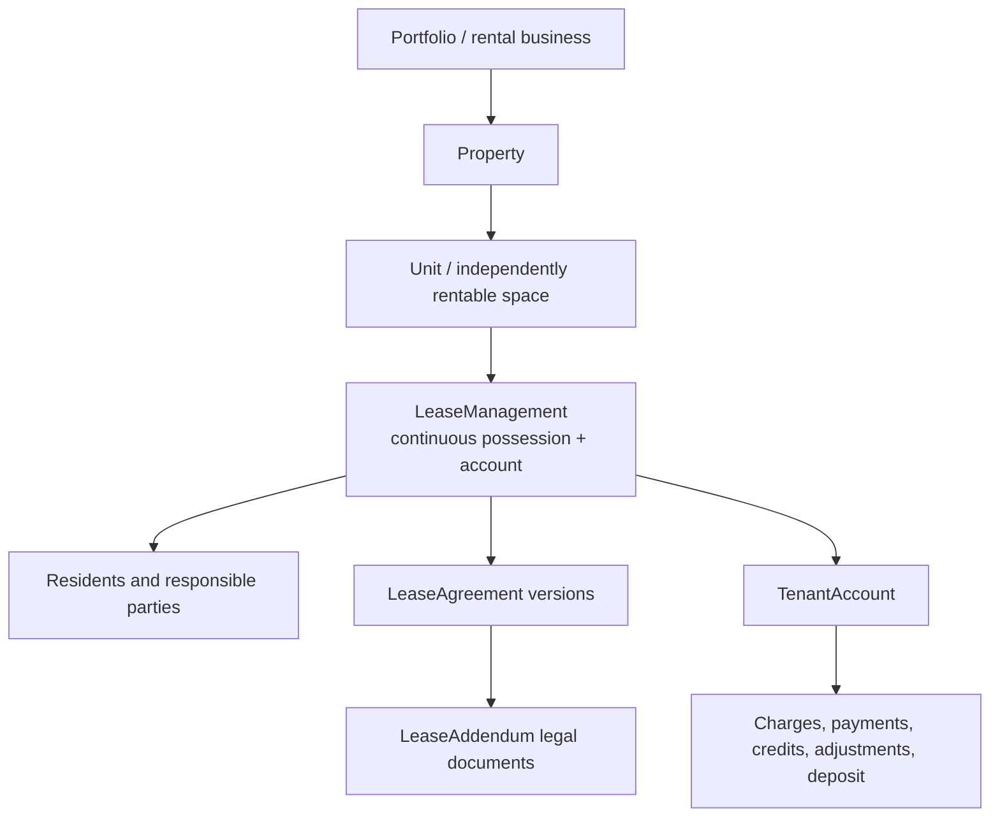

# Rental Command foundation blueprint

**Date:** 2026-07-10

**Status:** Approved by the product owner on 2026-07-10. Implementation is authorized in the isolated foundation worktree using the destructive checkpoint sequence below.

**Primary tasks:** TSK-670 roles/access and application experiences; TSK-672 atomic database writes; TSK-674 scan-first global capture

**Dependent task:** TSK-668 notification settings and tenant notice templates

**Applies to:** database, API, Engine, web, Flutter mobile, owner portal, tenant portal, notifications, documentation
**Data posture:** destructive forward-only reset; nothing is live, so there are no backfills, compatibility bridges, dual reads/writes, old route aliases, or legacy-role mappings

## Review basis

- Three web reviewers inspected code and live UI at 1600×1000 plus a separate 390×844 pass.
- Three mobile reviewers inspected Flutter code; one performed a full read-only pass and another a targeted novice-flow pass on the connected Samsung SM-S906U.
- Reviewers separately covered novice-landlord usability, visual/accessibility quality, management-company operations, role/access boundaries, mobile routing, and cross-platform parity.
- A final consensus architect, devil’s advocate, and evidence adjudicator challenged the combined recommendations against code and saved screenshots.
- The strongest current failures were independently reproduced: nine Unit tabs plus a nine-stage pseudo-navigation layer on web, two simultaneously visible mobile tab levels that can compete for attention inside Unit detail, inconsistent Team roles, tenant accounts mixed into Team, broad notification settings authorization, blank notice templates, tenant delivery coupled to staff settings, contradictory occupancy, some duplicated contextual/global record shells, client-side data reconciliation, and split audit/database saves.
- Product-owner review correctly rejected treating Material tabs, scrollable tab rows, FABs, modal bottom sheets, steppers, or the existing global/contextual creation pattern as defects by themselves. The current mobile domain tabs already expose Properties, Owners, Units, Tenants, Leases, and Applications; the Unit Command Center already supplies a context-aware work-order action; and global lists already provide alternate entry points.

## Preservation-first UI boundary

The foundation work changes a UI pattern only when a reproduced usability, authorization, data-integrity, or maintainability problem justifies it.

**Preserve and improve:**

- Mobile bottom navigation: Today, Rentals, Money, Work, and Inbox for the Management experience.
- The Rentals collection row: Properties, Owners, Units, Tenants, Leases, and Applications remain independently searchable global lists.
- Horizontally scrollable tabs on touch devices when the peer destinations do not fit.
- Unit-local tabs as the fast way to move between everything about the selected rental.
- Context-aware FABs, including Unit-prefilled creation, plus global create actions that ask for missing context.
- Modal bottom sheets for short create/edit work and full-height sheets where the form needs more room.
- Steppers for genuinely long or dependent workflows such as move-in preparation, lease creation/renewal, and complex notice setup.
- Android Back dismissing a sheet before leaving the underlying screen.
- One work order, payment, lease, application, or message being reachable from both its global list and its Unit context.

**Change only where the evidence supports it:**

- Do not show the Rentals collection tab row and the Unit-local tab row at the same time. Entering a Unit temporarily replaces the collection row with the Unit row; Back restores the originating collection and its scroll/filter state.
- Group the nine web/eight mobile Unit tabs into six clearer Unit tabs without deleting their contents. Secondary tabs or segmented controls remain inside a cohesive area.
- Remove the clickable lifecycle rail as a second competing navigation system; retain lifecycle facts and one next action in Summary.
- Make tab state addressable and restorable. A validated query parameter is acceptable; a path segment is not inherently more meaningful.
- Convert a modal/sheet to a dedicated page only when the task needs durable deep linking, interruption/resume, multi-record comparison, or a large legal/document workflow.
- Correct role/access projections, notification audiences, lease renewal/versioning, occupancy truth, SQL-side querying, and atomic writes.

## Executive decision

Rental Command will use one coherent model from a sole landlord through a management company:

1. A **Property** is the ownership, building, tax, loan, insurance, and shared-cost context.
2. A **Unit** is one independently rentable physical space and remains the contextual Command Center through vacancy, listing, occupancy, renewal, move-out, turnover, and later households.
3. `Property.RentalStructure` is either `SingleRental` or `MultiRental`. It changes presentation and setup only; it does not create different entities, calculations, lease models, or APIs.
4. A **LeaseManagement** record is one continuous possession and tenant-account relationship at one Unit. The UI calls this **Tenant & lease**, not “Tenancy” or “Lease management.”
5. A **LeaseAgreement** is an immutable issued legal agreement/version within LeaseManagement. Corrections, renewals, restatements, and month-to-month conversions create new agreement rows.
6. A **LeaseAddendum** is its own issued legal document. It identifies the agreement it amended while remaining part of the continuous LeaseManagement relationship for effective-term and billing purposes.
7. Tenant charges, payments, credits, adjustments, and the deposit belong to one **TenantAccount** under LeaseManagement. Agreement and addendum identifiers provide legal provenance without fragmenting the account.
8. Current lease status is calculated DB-side from durable facts and dates. The system does not rely on a mutable `Active` or `Expired` value or on a timer successfully changing it.
9. Database invariants—not only UI/API pre-checks—prevent overlapping governing agreements, overlapping Unit occupancies, duplicate billing periods, and competing active signature packets.
10. Every related database mutation commits once or inside one explicit transaction. Business state, audit, ledger, and outbox records cannot partially commit.
11. Team access uses understandable job presets: Workspace Administrator, Property Manager, Leasing Agent, and Maintenance Technician. A person may hold multiple separately scoped assignments; Owner and Tenant are relationships and portal experiences.
12. Global navigation is workstream-centered; Unit navigation is context-centered. A record has one domain identity, command implementation, lifecycle, and audit trail, with one authorized canonical projection/route per experience.
13. Web and mobile provide the same business capabilities but deliberately use layouts suited to each platform.
14. Tenant notices are independent of staff alerts and begin with editable copies of supplied templates rather than blank editors.
15. Scan is the primary intake path. It remains globally available alongside contextual manual actions, inherits typed route context, proposes a destination and populated command, and never saves until the user verifies it.

## Product mental model

The product should answer three questions without requiring the user to understand the database:

- **Across my business:** What work needs attention?
- **At this rental:** What is happening here now?
- **For this tenant relationship:** Who lives here, what did they agree to, and what is owed?

The internal hierarchy is:



Users do not navigate through every node. A global payment, application, work order, message, or notification opens its canonical record directly with Unit context preserved.

## Canonical glossary

| Term | Meaning | User-facing treatment |
|---|---|---|
| Portfolio | One landlord or management business | Usually invisible; shown in account/context switching |
| Property | Ownership/building context containing one or more Units | Visible as its own workspace only for MultiRental properties |
| Unit | One independently rentable physical space | Shown as the street address for SingleRental; unit label plus property for MultiRental |
| RentalStructure | Stable property setting: SingleRental or MultiRental | Setup/navigation behavior only |
| LeaseManagement | Continuous possession and tenant-account episode at one Unit | “Tenant & lease” |
| LeaseAgreement | One issued legal terms/document version | “Lease agreement” |
| LeaseAddendum | Separate executed change to legal terms | “Addendum” |
| TenantAccount | Continuous financial account for the LeaseManagement episode | “Tenant account” |
| Workspace role | Job performed inside the management business | Team role |
| Job assignment | One role profile plus its property/work scope for a team member | Team access and responsibility |
| Relationship access | Records someone owns or occupies | Owner portal or Tenant portal access |
| Experience | Purpose-built application shell | Management, Leasing, Maintenance, Owner, Tenant |

## One Unit model; single/multi is presentation structure

There are not separate “single rental” and “multi rental” entities.

### SingleRental

- The Property has exactly one canonical Unit created atomically during setup.
- The UI presents the address as one combined rental workspace and suppresses the otherwise redundant Property navigation layer.
- The combined workspace is not one giant page. Property-only concerns have binding placements: compact ownership/insurance/tax facts on Summary; Tenant account, Unit costs, Property expenses, and Financing as distinct Money subsections; property work under Maintenance; property files under Documents & history; structural settings under Edit rental.
- The user does not see an artificial “Property → Unit 1” drill-down.
- The same Property, Unit, LeaseManagement, Agreement, account, work-order, and reporting tables are used.

### MultiRental

- The Property workspace is visible because it adds shared-building meaning.
- It lists server-paged Units and provides property-wide ownership, finances, shared work, and records.
- Opening a Unit enters the same Unit workspace used by SingleRental.

### Why the setting is persisted

The UI must not infer structure from Unit count. A duplex remains MultiRental while only its first Unit has been entered. A partially configured building must not change navigation unexpectedly when another Unit is added. Property type may suggest a default, but setup confirms a persisted value.

Conversion from SingleRental to MultiRental is an explicit guarded operation that preserves the existing Unit ID. Conversion back is disallowed after multiple Units or conflicting history exist.

## LeaseManagement lifecycle

LeaseManagement is created in `Planned` state by the atomic Prepare move-in command after an application is approved and the Unit, household, planned possession, rent, and deposit are confirmed. That command creates party memberships, the TenantAccount, and the initial Agreement draft together. Portal access does not begin merely because an application was approved; it begins under an explicit invitation/access policy tied to the planned relationship. LeaseManagement ends only after possession returns to management and the account is deliberately closed.

If the household never signs or never takes possession, cancel the planned LeaseManagement with a durable reason and timestamp. It never becomes an occupancy interval. Draft/unissued artifacts may be canceled; issued artifacts follow their void/replacement rules. Posted financial entries are never deleted: refunds, reversals, or adjustments resolve any money already posted.

### It continues through

- a fixed-term renewal
- a month-to-month conversion
- a corrected or restated agreement
- a rent change documented by a new agreement/addendum
- adding or removing a non-responsible occupant
- adding or removing a responsible party when properly documented and the underlying account/possession relationship continues

### A new LeaseManagement is created when

- possession has returned to management and a later household moves in
- the responsible household is wholly replaced rather than amended
- management deliberately closes one tenant account and opens another
- a Unit transfer closes the old Unit relationship and opens one at the destination Unit

### Possession and occupancy truth

Agreement state, physical occupancy, marketing availability, account condition, and turnover are independent concerns.

- `PlannedPossessionAt` schedules a move-in.
- `PossessionGivenAt` opens the physical occupancy interval.
- `PossessionReturnedAt` closes it.
- `Occupied` derives DB-side from an open possession interval, not from an Agreement status or mutable Unit flag.
- `Move-in scheduled`, `Turnover`, `Vacant`, and `Out of service` derive from their own durable facts.
- An executed/governing Agreement without recorded possession creates a visible reconciliation exception such as `Lease active; move-in not recorded`; it never silently produces conflicting occupancy percentages.

Unit Summary, Property occupancy, Money analytics, lists, reports, and notification candidates consume the same database view/projection for occupancy truth.

### Party roles

Keep the role set small and understandable:

- `PrimaryTenant` — primary financially responsible signer/contact
- `CoTenant` — additional financially responsible signer
- `Guarantor` — responsible guarantor who may not occupy the Unit
- `Occupant` — resident without contractual payment responsibility

Membership is effective-dated so the system can answer who lived there or was responsible at any point without modifying signed agreements.

## LeaseAgreement version rules

### Draft and issuance

- A draft is editable until a signature packet is issued.
- Issuing a packet freezes the rendered document, agreement payload, template version, signer set, and document hash.
- If an issued packet contains a mistake, void that packet and create a replacement agreement version. Never alter what a signer already received.
- Only one non-void signature packet may be awaiting completion for the same proposed agreement change.

### Execution and replacement

- Once fully executed, contractual columns and PDFs never change.
- `LeaseManagementId` groups every agreement version for the continuous relationship.
- `VersionNumber` is unique within LeaseManagement and strictly increases.
- `ChangeType` explains why the row exists: Initial, Correction, Renewal, MonthToMonth, or Restatement.
- `ReplacesAgreementId` links a correction/replacement to the prior issued agreement when applicable.
- The prior agreement receives a `SupersededAt` fact only when the replacement becomes legally effective.
- A future renewal may be fully executed while the current agreement remains governing until the renewal start date.
- A retroactive correction never rewrites posted ledger entries. Any financial difference is applied through explicit typed reversals or adjustments with Agreement provenance.

### Derived agreement status

Status is a DB-side read model, not a mutable source field:

1. `VoidedAt` exists → Void
2. `SupersededAt` exists → Superseded
3. no issued packet → Draft
4. issued but not fully executed → Awaiting signatures
5. executed and start date is in the future → Upcoming
6. executed, effective today, and not ended → Active
7. executed and end date has passed → Expired

The query reads durable columns and signature facts. It does not replay AuditLogs and does not depend on a background worker changing status at midnight.

### Database invariants

- One governing agreement interval at a time per LeaseManagement.
- One governing base Agreement per date may coexist with zero or more executed effective Addenda; Addenda are not competing base intervals.
- No overlapping possession intervals for different LeaseManagement records at the same Unit.
- One open signature packet per proposed agreement change.
- Unique agreement version per LeaseManagement.
- Contract dates and monetary terms are validated before issuance.
- The API performs friendly pre-checks; database constraints close concurrency and bypass races.

## LeaseAddendum rules

- An addendum links to both `LeaseManagementId` and the exact `BaseAgreementId` it amended.
- It has its own version, signer set, signature request, issued PDF, hash, effective dates, and void/supersession facts.
- Draft addenda are editable; issued addenda are frozen under the same rule as agreements.
- Financial effects are typed: recurring amount delta, one-time charge, deposit change, or non-financial terms.
- Billing includes only executed, non-void financial effects effective for the billing period.
- A correction does not silently erase existing addenda. The replacement workflow explicitly states whether each active addendum remains effective or is incorporated/superseded.
- A renewal builder explicitly carries a term into the renewal or ends it; no addendum silently carries across a new term.

## Financial ownership and ledger

One continuous TenantAccount belongs to LeaseManagement. This prevents a correction or renewal from splitting the resident balance, deposit, or payment history.

### Canonical ownership

| Record | Canonical parent | Optional provenance/context |
|---|---|---|
| Recurring rent charge | TenantAccount | LeaseAgreementId |
| Addendum charge | TenantAccount | LeaseAddendumId |
| Payment | TenantAccount | provider transaction, allocation records |
| Credit/adjustment | TenantAccount | source entry and reason |
| Refund/reversal | TenantAccount | entry being reversed |
| Security deposit holding | LeaseManagement/TenantAccount | originating AgreementId |
| Operating expense | Exactly one operational scope: Portfolio, Property, Unit, or WorkOrder | allocation rows, WorkOrder/Unit/Property context |
| Work-order receipt | WorkOrder | Unit/Property inherited through work order |

### Ledger rules

- Financial entries are typed relational rows, not generic JSON events.
- Posted entries are append-only; corrections use reversals or adjustments.
- A balance is a DB-side aggregate over posted entries, never maintained by an unprotected mutable total.
- Every scheduled charge has a unique business key such as account + period + charge type + source.
- Provider transaction IDs and webhook event IDs are unique idempotency keys.
- Provider inbox records, ledger entries, audit records, and required outbox work commit atomically.
- Reconciliation compares provider settlements and contractual obligations with local ledger entries to find missing or incorrect data that no event history could infer by itself.

### Expense allocation rules

- A shared expense is stored once at its real operational scope; it is never copied into each Unit.
- Optional typed allocation rows distribute an expense to properties, Units, or OwnerEntities for reporting and statements.
- Allocation amounts must equal the allocated total and commit atomically with the expense.
- WorkOrder expenses inherit their Property/Unit context, while owner-statement allocations remain separate reporting facts.
- Portfolio, Property, Unit, work-order, and owner aggregates execute DB-side from the canonical expense and allocation rows.

## Operational state and audit history

LeaseManagement stores durable operational facts such as planned possession, actual possession, notice, planned move-out, possession returned, and account closed timestamps.

Independent concerns are not forced into one status enum:

- lifecycle: preparing, upcoming, occupied, ending, closed
- account condition: current, past due, payment plan, collections
- legal process: notice and eviction case state
- maintenance/turnover state

The UI may show several badges simultaneously, for example `Occupied`, `Past due`, and `Notice given`.

AuditLogs remains the append-only forensic record across the model:

- actor user ID or non-user actor
- explicit actor type: User, ApiCredential, or SystemAutomation
- stable actor/credential/job identifier and display label
- timestamp and IP/request correlation where available
- entity type, row ID, operation, old values, new values, and change reason

Audit history exists for legal evidence, user disputes, support, and forensic diagnosis. It may assist repair but is not the operational ledger or the source used to calculate lease status.

## Atomic-write contract

TSK-672 is the first implementation gate.

### Hard rule

Related database mutations use one `SaveChanges` call or one explicit transaction containing every required save. No business operation may leave a partially committed parent/child, business/audit, business/outbox, signature/document, or ledger/allocation state.

### Required patterns

- Prefer building the full tracked object graph and saving once.
- When multiple saves are structurally necessary, use the EF execution strategy with an explicit transaction.
- Write business facts, audit rows, and outbox rows in the same transaction.
- Never keep a database transaction open across a remote payment, e-sign, email, SMS, storage, or AI call.
- Persist intent/inbox/outbox atomically, perform the external action idempotently, then persist the result in another explicit atomic command.
- Use unique business keys and provider IDs to make retries safe.
- Every deliberately separate commit documents recovery and reconciliation.

### First confirmed audit target

The current audit interceptor saves business changes and then performs another SaveChanges from `SavedChanges`. The current explicit audit service also describes preserving an audit entry independently of a later rollback. Both behaviors must be replaced so required audit data and the business mutation succeed or fail together.

### Verification

- Inject an exception at every former save boundary and prove all-or-nothing results.
- Run concurrent commands and prove database constraints reject races.
- Sweep all API and Engine `SaveChanges`, transaction, audit, outbox, inbox, ledger, signature, and document paths.
- Re-run the audit after the destructive domain rewrite.

## Identity, roles, relationships, and scope

The access model has four independent layers:

| Layer | Question |
|---|---|
| Login identity | Who signed in? |
| Workspace membership | What job may they perform? |
| Business relationship | What do they own or occupy? |
| Resource scope | Which properties, Units, or assignments may they access? |

### Workspace membership and job assignments

`WorkspaceMembership` says that a person belongs to the management business. It may have one or more separately scoped `MembershipRoleAssignment` rows. Each assignment supplies one seeded job profile, capabilities, and its own Property/work scope. Authorization succeeds only when one assignment supplies both the required capability and matching scope; capabilities are never unioned first and scoped afterward.

The customer UI starts with four understandable job presets. They are seeded role-profile definitions rather than a permanent closed user enum, so later Accounting or Regional Manager presets do not require another identity rewrite. There is no custom-role or raw capability designer in the first release.

| Job preset | Purpose | Default scope | Financial access | Account authority |
|---|---|---|---|---|
| Workspace Administrator | Landlord/business principal or trusted administrator | All properties | Full | Team, security, billing, integrations, exports, banking configuration, payouts, destructive account actions |
| Property Manager | Runs daily operations and assigns existing staff within scope | All or selected properties | Balances, charges, payments, expenses, deposits, owner reports, and operational reconciliation within scope | May assign work/leasing responsibility to existing in-scope members; no invitations, role/scope changes, bank connection/credential/payout management, security/billing, destructive reconciliation, or self-scope expansion |
| Leasing Agent | Listings, applicants, showings, agreements, onboarding | All or selected properties | Only terms and deposits required for leasing | No accounting, banking, owner distributions, team, or security |
| Maintenance Technician | Performs internal work | Assigned work orders only | None | No general Unit browsing, assignment authority, or settings |

One person may hold Leasing Agent for Property A and Maintenance Technician for Property B without receiving a blended broad shell. The Team flow asks: what do they do, where do they do it, and what are they responsible for. The vague `Agent`, customer-facing `Owner`, and `Viewer` team roles are removed.

### Relationship access and Owner model

- A sole landlord is a Workspace Administrator linked to the primary OwnerEntity. Management is the default experience; no “Admin or Owner?” choice appears.
- Effective-dated `PropertyOwnership` links Property and OwnerEntity with ownership share and statement/payee facts.
- `OwnerUserAccess` grants a login access to one OwnerEntity. Owner projections expose only that entity’s owned-property summaries, statements/documents, explicitly routed approvals, and approved messages.
- Owner approval policies may express rules such as repairs over a threshold, but Owner access never grants lease, tenant, Team, bank, or management mutations.
- Tenant portal access is granted through `TenantUserAccess` tied to effective LeaseManagement party membership.
- A user may have workspace job assignments and external Owner/Tenant relationships, but one never grants the other.
- Platform/system administration is a separate product-operator policy and never appears in customer Team settings.

### Capability, scope, responsibility, and access revision

- Stable capabilities authorize actions; resource scope and relationship/assignment joins authorize records.
- Responsibilities are separate routing facts for queues and notifications; a job title alone does not imply that every event goes to every person with that title.
- Every request applies access joins before projection, grouping, sorting, paging, or aggregation.
- Restricted experiences use purpose-built DTOs/projections. Financial or private fields are never serialized and merely hidden.
- Cross-scope existence-sensitive requests return 404; denied actions on visible records return an explanatory 403.
- `AccessRevision` changes when memberships, job assignments, scopes, responsibilities, relationships, or status change.
- On revision change, connected clients suspend mutations, refresh their access envelope, rebuild the shell, remove unauthorized routes, purge affected caches/files, reconnect realtime, and discard invalid pending navigation intents.
- A disconnected device cannot be forced to forget data already displayed. Restricted mobile caches therefore contain the minimum projection, are encrypted and short-lived, and sensitive access instructions are fetched just in time where possible. Every queued mutation is reauthorized by the server at sync time.

### Active experience

Each membership has a default experience. A valid deep link may select another authorized experience; otherwise the last authorized choice is restored, then the fallback order is Management, Leasing, Maintenance, Owner, Tenant. `Switch experience` appears only when more than one experience is available. A sole landlord with Administrator and Owner access enters Management without being asked.

## Application experiences and global navigation

### Management

Workspace Administrators and Property Managers use the same workstream structure with different capabilities and scope labels.

The Management shell keeps the existing workstream organization:

- Today
- Rentals
- Money
- Work
- Inbox

Reports and Settings are secondary destinations. Scan, Add, Ask, Help, and incomplete setup are actions/utilities, not peer workstreams. Mobile keeps the same five bottom destinations; Team, Settings, Help, experience switching, and sign-out live in Account.

Inside **Rentals**, both web and mobile keep direct global destinations for:

- Properties
- Owners
- Units
- Tenants
- Leases
- Applications

The mobile destinations use the existing scrollable collection tab row. Web keeps them as expanded sidebar items under Rentals. Opening a Unit is an additional contextual entry point, never the only way to find a lease, tenant, application, or work order.

Property Managers receive daily operational money tools inside scope and may assign work or leasing responsibility to existing in-scope team members. Bank connections, credentials, payout destinations, transfers/distributions, billing, security, membership invitations, role/scope changes, exports, and accounting integration administration remain Administrator-only unless a future explicit preset/capability is granted.

### Leasing

For Leasing Agents:

- Today
- Pipeline
- Rentals & listings
- Calendar
- Inbox
- Profile in account navigation

### Maintenance

For Maintenance Technicians:

- My work
- Schedule
- Assignment conversations/Inbox
- Profile

A technician opens a purpose-built assignment containing the problem, address/Unit, safe access instructions, permitted contact, schedule, notes, photos, time, materials, and status. The management Unit workspace and management DTO are never exposed.

### Owner

- Overview
- Properties
- Statements & documents
- Approvals
- Messages

### Tenant

- Home
- Account & lease
- Maintenance
- Messages
- Profile

Owner and Tenant are relationship-scoped experiences, not reduced management shells.

## Scan-first capture foundation

Scanning is the product's defining workflow: the computer does the typing and routing, while the user verifies the result. Manual forms remain available, but they are a fallback and correction surface rather than the only complete path.

- Management, Leasing, and permitted Maintenance screens retain one persistent, clearly labeled `Scan / Add` action. It never disappears when a contextual action such as `Add owner`, `New lease`, `Record payment`, or `New work order` is available.
- Mobile preserves the existing expandable quick-action pattern. Scan is the first emphasized action; the current contextual manual command, Tell me/voice, and Ask remain available. A generic closed `+` that hides the flagship is replaced by a labeled `Scan / Add` affordance.
- Web keeps the pinned Scan / Edit destination and adds a persistent shell-level `Scan / Add` action; screen-specific create buttons remain visible.
- Camera, gallery, multi-page capture, PDF/file, voice, and manual entry converge on typed capture intents and the same domain commands used by ordinary forms.
- A typed `CaptureContext` carries the active experience, workspace, Property, Unit, LeaseManagement, TenantAccount, and focused payment, work order, application, agreement, or other record when present. The review surface displays inherited context and allows an authorized change before save.
- Global capture classifies first and asks only for unresolved target context. Candidate searches are remote, server-filtered, sorted, and paged; clients never preload a partial record set and filter it locally.
- The AI pipeline may classify the document, extract fields with confidence/evidence, and propose a target command. It cannot authorize, validate, allocate money, create legal state, or persist directly.
- Review shows the source document beside extracted fields, proposed destination, confidence/warnings, duplicate matches, and the exact record/command that will be created or updated.
- Confirmation executes one authorized, validated, idempotent, atomic domain command with audit and required outbox work. Source documents are stored once and linked to the resulting records.
- Interrupted/offline capture uses retryable drafts and idempotency/document hashes so a retry cannot duplicate a payment, check, receipt, agreement, or external side effect.
- Role projections constrain both supported capture types and visible extracted fields. A technician may attach permitted work evidence; Owner and Tenant capture remains limited to their explicit portal workflows.
- Every mobile global collection list has a visible search field beside Filters, active-filter feedback, server-side paging, and restoration of query/filter/scroll state after opening a Unit and returning.

## Primary lifecycle workflows

### Application to move-in

1. Review and approve/decline the application.
2. `Prepare move-in` confirms the Unit, household roles, planned possession, rent/deposit, and business terms. The approved application and requested Unit remain preselected.
3. One atomic command creates Planned LeaseManagement, effective party memberships, TenantAccount, and initial Agreement draft.
4. Issue and complete the signature packet.
5. Record actual possession separately; that fact opens occupancy.

Approval never silently creates a mutable “active lease,” and the user never reselects context already known from the application.

### Renewal, month-to-month, and ending

From the current Tenant & lease relationship, the user chooses Renew, Offer month-to-month, or End relationship. Renewal/month-to-month creates a new Agreement under the same LeaseManagement. It may be executed upcoming while the current Agreement still governs. Ending records the decision/notice path; it does not close LeaseManagement until possession returns and the account is deliberately closed.

### Correction and Addendum

An issued Agreement is never edited. Correction voids/replaces the affected artifact under its legal rules and preserves provenance. An Addendum remains a separately signed document linked to the Agreement it amends. Neither operation rewrites posted money; explicit ledger reversals/adjustments express any retroactive financial effect.

## Unit Command Center information architecture

The Unit remains the contextual home. Fewer destinations are useful only when their labels remain obvious.

### Six canonical Unit areas

1. **Summary** — independent lifecycle/condition summaries, occupancy, next action, current household/agreement, balance/deposit, open work, upcoming dates, and recent snippets.
2. **Leasing** — listing, marketing, showings, applications, screening, and first move-in preparation.
3. **Tenant & lease** — household, responsibilities, agreements, renewals, signatures, addenda, tenant notices, and previous LeaseManagement episodes.
4. **Money** — Tenant account and Unit operating costs as clearly separated subsections.
5. **Maintenance** — work orders, inspections, recurring maintenance, and turnover/make-ready.
6. **Documents & history** — a cross-domain index of files, source-linked activity, and permitted audit history; it is never a second editable copy of the source record.

### Binding content ownership

| Area | Owns | Does not own |
|---|---|---|
| Summary | Current state, current household/agreement summary, balance/deposit summary, open work, dates, next action, recent snippets | Full editable records or duplicate lists |
| Leasing | Listing, marketing, showings, applications, screening, and Prepare move-in | Executed agreement history or tenant account |
| Tenant & lease | Parties, responsibilities, Agreement versions, signatures, Addenda, renewals, tenant-facing notices, prior LeaseManagement episodes | Applications queue or operating expenses |
| Money | Tenant account, deposits, Unit costs; SingleRental Property expenses/financing in separate subsections | Agreement editing or work execution |
| Maintenance | Work orders, inspections, recurring maintenance, turnover | Full receipts ledger or cross-domain archive |
| Documents & history | Subject-grouped index and source-linked activity/audit | A miscellaneous home for domain history, settings, or editable records |

### Navigation behavior

- Each area is stable addressable state on web and a typed destination on mobile.
- Desktop web uses one row of six Unit-local tabs beneath the persistent Unit header. Rental Command web is desktop-first; it is not redesigned into a second phone application. If the available web width is unusually narrow, the same tab row may scroll rather than wrap into an ambiguous grid.
- URL, back/forward, refresh, bookmarks, and new tabs preserve the exact area and meaningful subsection.
- Peer navigation inside an area is allowed only when it clarifies one cohesive subject, such as `Tenant account | Rental expenses` or `Work orders | Inspections | Turnover`; no area has more than one subordinate peer control.
- Do not stack unrelated tab systems whose state cannot be restored.
- Mobile keeps a horizontally scrollable Unit-local tab row: Summary, Leasing, Tenant & lease, Money, Maintenance, and Documents & history. The row follows the Material touch-navigation pattern already used by the app.
- While Unit detail is open, the outer Rentals collection row is hidden so the user sees one tab row, not `Properties / Owners / Units / ...` above `Summary / Leasing / ...`. Android Back restores the originating collection, selected collection tab, filter, and scroll position.
- Grouping is a navigation cleanup, not a functionality deletion: `Listing + Applications → Leasing`; `Lease + Tenants → Tenant & lease`; `Ledger → Money`; `Work + Turnover + inspections/recurring work → Maintenance`; `Documents + Timeline → Documents & history`.
- Secondary tabs or segmented controls remain available inside a cohesive Unit area, and the contextual FAB changes to that area's primary create action.
- Unit identity remains visible throughout contextual work.

### Lifecycle presentation

The nine-stage clickable rail is deleted. Summary shows compact, DB-derived facts for occupancy/possession, leasing availability, TenantAccount condition, legal/notice condition, and maintenance/turnover condition, followed by one prominent Next action. Chronological facts remain in their owning section/history. Users never manually drag or click a Unit through a generic `Active` lifecycle.

### Canonical records and entry points

A work order, payment, application, agreement, inspection, notice, or conversation has one domain identity, command implementation, lifecycle, and audit trail. It has one authorized canonical projection/route per experience—not one universal screen containing every field.

For example, one work order appears in:

- Unit → Maintenance
- the global Work queue
- the assigned technician’s My Work list

Creating from the Unit preselects server-validated Unit and current LeaseManagement context. Creating globally lets the user select them through remote, server-paged search. Both call the same command and open the same Management record. A technician, Owner, or Tenant opens the same domain record through its restricted experience route and projection.

### Property workspace

MultiRental properties expose:

- Summary
- Rentals
- Ownership & management
- Property work
- Property finances
- Documents & history

SingleRental properties suppress only the redundant intermediate Property-detail navigation layer and surface those property-only subjects inside the combined Unit workspace. They still appear in the global Properties list, and the same Property and Unit entities remain present in the model.

The management Owner directory is a secondary `Rentals → Owners` relationship view, not Team and not a Settings tab. Property ownership is assigned in Property → Ownership; Owner portal access is managed from the OwnerEntity/person relationship.

## Canonical route and navigation intent

Meaningful destinations are addressable, restorable navigation state. A validated `?tab=`/`?view=` value is acceptable when refresh, Back/Forward, bookmarks, shared links, and tests preserve it; changing it to a path segment has no inherent user benefit.

Representative web routes:

```text
/properties
/owners
/units
/tenants
/leases
/applications
/units/:unitId?tab=summary
/units/:unitId?tab=leasing&view=applications
/units/:unitId?tab=tenant-lease&view=agreements
/units/:unitId?tab=money&view=tenant-account
/units/:unitId?tab=maintenance&view=work-orders
/units/:unitId?tab=records&view=documents
/leases/:agreementId
/maintenance/:workOrderId
/applications/:applicationId
/messages/:conversationId
/maintenance/work/:workOrderId
/owner/approvals/:approvalId
/portal/maintenance/:workOrderId
```

These examples deliberately preserve familiar resource URLs. Final names are selected once, implemented directly, and old alternatives are deleted rather than retained as aliases.

The API and notification system return a typed `NavigationIntent` containing experience, destination ID, access context, resource kind/ID, optional parent/child resource, action, access revision, expiry, and safe fallback destination. Web maps it to a URL; Flutter maps it to a typed route. The API never returns raw web URLs for mobile to parse.

### Mobile stack and back contract

- Each bottom destination owns an independent in-session stack.
- Switching bottom destinations preserves the prior stack.
- Re-selecting the active destination pops the current domain to its selected collection root and scrolls to top; `Units`, `Owners`, and the other Rentals collections are deliberate visible roots, not hidden implementation state.
- Android Back dismisses an open bottom sheet first, then pops record detail → Unit context → the exact originating global list. At a bottom-root it exits rather than walking prior bottom destinations.
- A cold deep link synthesizes the smallest safe stack: experience home → domain landing → Unit Summary when applicable → section → record.
- A warm intent may preserve an authorized origin for breadcrumbs/back, but origin never changes permissions or the canonical component.
- Revoked, expired, malformed, or cross-account intents are discarded and land on a safe authorized home with a plain explanation.

### Route state and accessibility contract

Every canonical route specifies initial loading, first-use empty, filtered no-results, network failure/retry, explanatory 403, revoked access, stale/offline, and malformed-ID states. Each web route has one `h1`, real form labels, announced save/error results, focus restoration, focusable sort controls, and no row/card button containers around nested actions. Status never relies on color. Controls meet a 44px target; dialogs trap/restore focus; help links are keyboard, touch, and screen-reader accessible; reduced motion and dynamic text remain supported.

## Notification settings after the foundation

TSK-668 is implemented after roles, scope, responsibility, and LeaseManagement exist.

Notifications has a small landing page and three durable route-backed settings pages. It is not one giant matrix and not a permanent all-settings stepper. A guided flow may be used only inside a complex first-time Tenant notice editor.

### My alerts

Personal channel preferences for the signed-in user: in-app, mobile push, email, and SMS. The screen says whose alerts are being configured and explains destinations.

### Team routing

Administrator configuration answers who is responsible for each topic:

- rent and money
- applications and leasing
- work orders
- owner statements/decisions
- account and security

Recipients resolve to named users at event time through job assignment, topic responsibility, Property scope, direct assignment, relationship, and AccessRevision. The UI previews real names, destination, scope, and reason, for example: `Alex receives this because Alex manages Rimview.` An unassigned internal topic falls back to active Workspace Administrators, and that fallback is visible. It never uses an unexplained “Staff / owner” audience and never silently includes Owner relationships.

### Tenant notices

Tenant delivery is independent per automation:

- mode: Off, Create draft for review, or Send automatically where permitted
- timing/schedule
- Tenant portal/in-app, mobile push, email, and SMS channels
- exact eligible recipients, destinations, and exclusion reasons from effective LeaseManagement party records
- template/version and failure behavior

There is no master `Send tenant notices` switch and tenant channels never inherit My alerts or Team routing channels. PrimaryTenant and CoTenant are eligible by default while effective. Guarantor receives only explicitly designated legally relevant notices. Occupant never receives financial/legal notices merely because they reside there.

Each LeaseManagement stores an explicit lease-ending disposition: Undecided, Offer renewal, Offer month-to-month, or Non-renewal/move-out. Workspace policy supplies timing, template, and default send mode for each disposition; automation acts only after a relationship decision exists.

### Supplied templates

Every new portfolio receives editable workspace copies of immutable versioned system templates atomically during setup:

- rent reminder
- lease renewal offer
- month-to-month offer
- lease expiration/non-renewal
- late rent/late fee

Each workspace template stores its system key, `BasedOnSystemTemplateVersionId`, own version, customization state, and last-updated facts. It provides realistic preview, edit, plain-language merge-field help, restore current default, update-available information, per-notice override, test-send where appropriate, and delivery/revision evidence. A system update never silently overwrites a customized workspace copy. Property-specific template inheritance is deliberately deferred.

Courtesy reminders, operational messages, and regulated/legal notices are classified separately. Statutory notices carry jurisdiction/version metadata, a retained rendered copy and delivery evidence, and cannot auto-send until the applicable jurisdiction/template has been explicitly reviewed. Default mode is Create draft for review.

### Required help documentation

Use one visible `How this works` link at a section/header and focused field help only for non-obvious or legal concepts. Help containing links opens a keyboard/touch-accessible popover or page, never a hover-only tooltip and never an icon beside every control.

- Team roles and access
- Property scopes
- Maintenance team access
- Owner portal access
- Tenant portal access
- My alerts
- Team routing
- Tenant notices
- Delivery channels
- Lease agreements, corrections, renewals, and addenda

## API, Engine, and SQL requirements

- The API is the authorization boundary; UI visibility is only a usability aid.
- Personal-alert endpoints authorize only the signed-in user’s destinations/preferences; Team routing, Tenant notice policy, provider tests, and delivery configuration use separate explicit administrative capabilities and projections.
- Record-home endpoints use one DB projection/view for header, lifecycle, counts, current LeaseManagement, account summary, and next action plus at most one bounded activity query and an optional third genuinely separate query.
- Section lists use dedicated server-paged endpoints.
- All filtering, joins, grouping, aggregation, sorting, authorization scope, and paging execute DB-side as one translated SQL statement or database view.
- No client-side Unit/lease joins, allowed-ID materialization, per-row authorization, N+1 follow-ups, or in-memory worker candidate filtering.
- Engine candidate selection, recurrence eligibility, retry eligibility, ordering, paging, and atomic claiming execute DB-side.
- Outbox delivery uses atomic claim/update semantics and idempotent handlers.
- Notification recipient resolution returns the final eligible deduplicated users/destinations directly from SQL.
- Generated SQL, measured principal-path query budgets, cross-scope decoy data, PostgreSQL integration tests, and EXPLAIN ANALYZE prove principal paths. The expected record-home budget is one projection/view, one bounded activity query, and an optional genuinely separate third query; code is not distorted merely to satisfy a slogan.

## Destructive vertical implementation sequence

Implementation uses one active isolated integration worktree at a time with checkpoint commits. It is not merged until the replacement is coherent. Each checkpoint proves a complete domain/API/web/mobile slice so usability is tested before the most expensive assumptions harden. Old and new behavior never ship together: replaced models, endpoints, routes, DTOs, providers, and seeds are deleted inside the integration branch as their slice lands. There are no compatibility bridges, aliases, dual reads/writes, or data-copy migrations.

### Gate 0 — approve this blueprint

- Approve domain boundaries, UI vocabulary, role matrix, navigation, notification structure, atomicity contract, and no-legacy posture.
- Convert the approved blueprint into file-by-file implementation tasks and checkpoints.

### Checkpoint 1 — kernel gate and TSK-672

- Add the hard atomic-write rule to Rental Command AGENTS guidance.
- Inventory every save/transaction boundary and every DB-side query-rule violation.
- Fix only surviving cross-cutting audit, outbox/inbox, ledger, idempotency, and atomic-claim infrastructure; obsolete paths are scheduled for deletion, not lovingly repaired.
- Add WorkspaceMembership, scoped role-profile assignment, active access context, AccessRevision, and reusable authorization/query primitives.
- Record obsolete violations for deletion rather than repairing paths removed by the rewrite.
- Add reusable failure-injection, transaction, query-translation, and cross-scope decoy tests.

### Checkpoint 2 — sole-landlord foundation slice

- Destructively baseline Property.RentalStructure, canonical Unit, Workspace Administrator membership, primary OwnerEntity/ownership link, supplied template copies, and SingleRental/MultiRental setup.
- Build sole-landlord Management home and Unit Summary on web/mobile with one server projection and typed navigation.
- Establish the persistent web/mobile Scan / Add shell action and typed CaptureContext envelope without retaining the generic hidden-scan quick-action behavior.
- Prove the simple address-level experience without exposing artificial Property → Unit or role choices.

### Checkpoint 3 — occupancy, agreement, and tenant-account slice

- Replace the mixed Lease model with LeaseManagement, effective parties, possession facts, LeaseAgreement, LeaseAddendum, TenantAccount, and typed ledger entries.
- Implement Prepare move-in, cancellation, issue/sign/replace/renew, Addenda, possession, portal access, payment/deposit, move-out, and transfer as atomic commands.
- Add governing/occupancy exclusion constraints, unique business keys, status/occupancy views, and reconciliation exceptions.
- Deliver Tenant & lease and Money sections plus the Tenant projection on web/mobile.
- Route lease, addendum, payment, and check captures through review into the same atomic agreement/account commands used by manual entry.

### Checkpoint 4 — maintenance and access-revocation slice

- Build management work orders/inspections/turnover, Technician assignments and restricted projections, reassignment, conversations, photos, time/materials, and canonical per-experience routes.
- Prove role/scope revision, connected cache/stack/realtime purge, offline TTL/re-sync rejection, and safe deep-link fallback on both clients.
- Delete embedded duplicate Unit/global detail implementations.
- Route work receipts, estimates, photos, and inspection documents through assignment-safe contextual capture.

### Checkpoint 5 — leasing slice

- Build listings, applications, screening, showings, assignment-aware pipeline, and application → Prepare move-in handoff.
- Deliver Leasing experience shell and Unit Leasing section on web/mobile with server-paged queues and remote selectors.
- Delete generic Add Lease/backfill and old broad application/lease flows.
- Route scanned applications and lease documents through the same application, Prepare move-in, and agreement commands.

### Checkpoint 6 — money, expense allocation, and Owner slice

- Complete charges, payments, deposits, expense operational scope/allocation, reconciliation, banking-capability split, owner statements/approvals, and Owner projections.
- Deliver MultiRental Property workspace and Owner experience on web/mobile.
- Prove Property Manager operational money without bank/integration/team authority.
- Complete receipt, bill, payment, and check classification, duplicate detection, allocation review, and atomic persistence.

### Checkpoint 7 — navigation, Team, and shell completion

- Complete capability-aware web/mobile shells, scoped multi-job Team/invite flow, active experience switching, six Unit areas, Property workspace, Documents & history index, typed NavigationIntent, and binding mobile sheet/Back behavior.
- Preserve mobile bottom navigation, Rentals collection tabs, Unit tabs, FABs, bottom-sheet forms, steppers, and global/contextual create entry points. Remove only the simultaneously visible outer/inner tab rows, un-restorable tab state, competing lifecycle navigation, unsafe raw path parsing, and replaced routes.
- Standardize visible server-side search/filter/paging and restored list state across Properties, Owners, Units, Tenants, Leases, and Applications; prove Scan / Add remains reachable from every permitted screen and carries focused context.

### Checkpoint 8 — TSK-668 notifications and documentation

- Build capability-separated My alerts, Team routing, Tenant notices, workspace template versions, previews, legal/courtesy classification, delivery evidence, help controls, and documentation.
- Remove the old staff/owner matrix, master tenant switch, blank templates, duplicate automation modes, broad authenticated settings DTO/controller, and tenant-channel inheritance.

### Checkpoint 9 — cutover audit

- Re-run repository-wide atomic-write, Engine candidate, DB-query, authorization-projection, and orphaned-legacy audits.
- Recreate development/test databases from the new baseline.
- Execute persona, lifecycle, occupancy, financial, allocation, legal-template, web, mobile, deep-link, access-revocation, accessibility, performance, and failure matrices with real browser/phone proof.
- Remove every obsolete model, migration, seed, endpoint, DTO, provider, screenshot baseline, and route before merge.

## Approval and verification matrix

### Domain

- Approved application → Prepare move-in atomically creates Planned LeaseManagement, effective parties, TenantAccount, and Agreement draft with the chosen Unit already present.
- A canceled/no-show move-in never opens occupancy and resolves issued artifacts, portal access, and posted money explicitly.
- Renewal remains the same LeaseManagement and produces a new Agreement.
- Correction freezes the old issued artifact and produces a linked version.
- Retroactive legal corrections never rewrite posted ledger rows; typed reversals/adjustments express financial effects.
- Future renewal may be Upcoming while the current agreement remains Active.
- Time alone moves the derived view from Upcoming to Active to Expired without a worker write.
- Possession facts—not Agreement status or Unit.Status—produce one occupancy truth consumed by Unit, Property, Money, reports, and Engine candidates.
- Roommate/occupant changes preserve history and do not silently rewrite agreements.
- A new household after possession return creates a new LeaseManagement.
- Addendum billing respects execution, effective period, voiding, and explicit renewal carry-forward.
- One tenant account and deposit continue through agreement versions.

### Data integrity

- Concurrent active-agreement attempts cannot both commit.
- Overlapping Unit occupancy cannot commit.
- Duplicate monthly charges and provider transactions cannot commit.
- Expense allocations balance exactly and cannot partially commit apart from the expense.
- Injected exceptions cannot leave business data without audit/ledger/outbox companions.
- Reconciliation identifies missing provider payments and missing contractual charges.
- Parallel Engine workers claim bounded candidates once; no eligibility or retry selection occurs in memory.

### Access

- Sole landlord sees full Management and is linked to the primary OwnerEntity without an Owner role choice.
- One member can hold two differently scoped job assignments without capability/scope leakage between them.
- Property Manager can operate and reconcile money for assigned properties but cannot connect/remove banks, change payouts/integrations, disburse funds, change Team/security/billing, or expand scope.
- Leasing Agent cannot retrieve accounting/owner data.
- Technician can retrieve and update only assigned-work context.
- Owner access is limited by effective ownership and OwnerUserAccess; one co-owner cannot infer another owner’s private financial/contact data.
- Owner and Tenant relationships do not grant management access and never appear as Team roles unless that login separately has membership.
- Direct URL/API requests and revoked access fail safely; connected clients purge immediately, while disconnected clients use minimum encrypted short-TTL projections and every later sync is reauthorized.

### Web and mobile usability

- A novice can locate rent, application, repair, agreement, and history from every Unit area without guessing abstract labels.
- Unit Summary answers occupancy, balance, agreement end, open work, and next action within 30 seconds.
- Desktop web and mobile both keep an obvious six-tab Unit row. Mobile tabs scroll when needed, visually indicate more content, and never appear underneath the outer Rentals collection row while Unit detail is open.
- Global and Unit entry points open the same Management payment/work-order/application/agreement ID/route and command; restricted experiences use their own safe route/projection.
- Web refresh, bookmark, forward/back, and open-new-tab preserve exact context.
- Mobile collection-tab and Unit-tab reselection, sheet dismissal, Android Back, cold/warm links, process restore, expired intent, and revoked access follow the binding stack contract.
- SingleRental users never traverse a redundant Property → Unit layer.
- MultiRental users can compare server-paged Units and access shared Property concerns.
- Restricted clients never receive forbidden fields.
- Search and Filters are visible on every mobile global collection; query, filters, selected collection, and scroll restore after opening a Unit and returning.
- Scan / Add remains visible beside contextual manual actions on every permitted management screen.
- Unit-, account-, agreement-, application-, payment-, and work-scoped scans display their inherited context before capture and review.
- Global scans classify first and request only unresolved target context.
- No AI extraction silently posts a financial, legal, lease, tenant, or maintenance mutation; the user verifies the proposed command before an atomic save.

### Notification usability

- The user can state who receives a team alert and why.
- Every tenant notice independently selects Off, Create draft for review, or Send automatically where permitted.
- Tenant delivery channels do not inherit from staff preferences.
- A portfolio begins with useful editable templates.
- Disabled automations cannot deliver tenant notices.
- Recipient resolution respects property scope, assignment, relationships, access revision, and deduplication.
- A statutory notice cannot auto-send without reviewed jurisdiction/template metadata; rendered copy and delivery evidence are retained.
- Owner/Tenant credentials cannot access administrative routing, provider-test, or delivery-configuration endpoints.

### Query and accessibility proof

- Generated SQL proves scope, filter, join, grouping, sorting, paging, candidate selection, and recipient resolution occur DB-side.
- Server-searched remote selectors never preload the first 100/200 records and pretend that is the data set.
- Web is verified at its intended desktop widths plus a narrow fallback sanity pass; Flutter is verified on small phones, dynamic text, screen readers, keyboard/focus where applicable, loading, empty, retry, 403, revoked, and stale/offline states.

## Decisions approved by accepting this blueprint

1. Unit remains the contextual center; LeaseManagement is the continuous occupancy/account record.
2. SingleRental/MultiRental is a persisted presentation structure on Property, not two business models.
3. LeaseAgreement and LeaseAddendum issued artifacts are immutable and versioned.
4. Agreement status is derived DB-side from durable facts and dates.
5. Tenant money belongs to one account under LeaseManagement; legal sources remain traceable.
6. AuditLogs remains the forensic trail; typed ledger entries remain the financial source.
7. Atomic writes are a hard repository-wide rule and first implementation gate.
8. Workspace Administrator, Property Manager, Leasing Agent, and Maintenance Technician are seeded job presets; one member may hold multiple separately scoped assignments and the schema is not a closed single-role enum.
9. Property Manager receives operational financial/reconciliation access within scope, while bank connections, credentials, payouts, integrations, and destructive authority remain Administrator-only by default.
10. Owner and Tenant are effective-dated relationships/experiences, not Team roles; Owner access derives from ownership and explicit OwnerUserAccess.
11. Possession facts produce one DB-side occupancy truth; Agreement, listing, account, and turnover states remain separate.
12. Expenses have one operational scope plus optional balanced allocation rows; shared expenses are never duplicated across Units.
13. Unit navigation is Summary, Leasing, Tenant & lease, Money, Maintenance, and Documents & history with binding content ownership.
14. Desktop web and mobile keep six Unit-local tabs; mobile uses a Material-style scrollable tab row. The outer Rentals collection row is hidden inside Unit detail so only one tab level is visible at a time. FABs, bottom sheets, and steppers remain first-class patterns.
15. One domain record/command/audit trail may have one purpose-built canonical projection/route per experience; Management global and Unit entries converge on the same Management route.
16. Mobile bottom-tab, Android Back, cold/warm intent, active-experience, and revoked-access behavior follow the explicit stack contract.
17. Notifications are separate My alerts, Team routing, and Tenant notices routes. Tenant automation modes are Off, Create draft for review, and Send automatically where permitted.
18. New workspaces receive versioned editable template copies; customized copies are never silently overwritten and regulated notices require jurisdictional review/evidence.
19. Implementation proceeds through destructive end-to-end vertical checkpoints with real web/mobile proof, not a long horizontal big bang.
20. The replacement is forward-only with no compatibility bridge, old route alias, dual read/write, or data backfill work.
21. Scan / Add is a persistent primary intake surface, not a removed or hidden side action; typed context, review, idempotency, authorization, atomic commands, and server-side target search are binding requirements.
